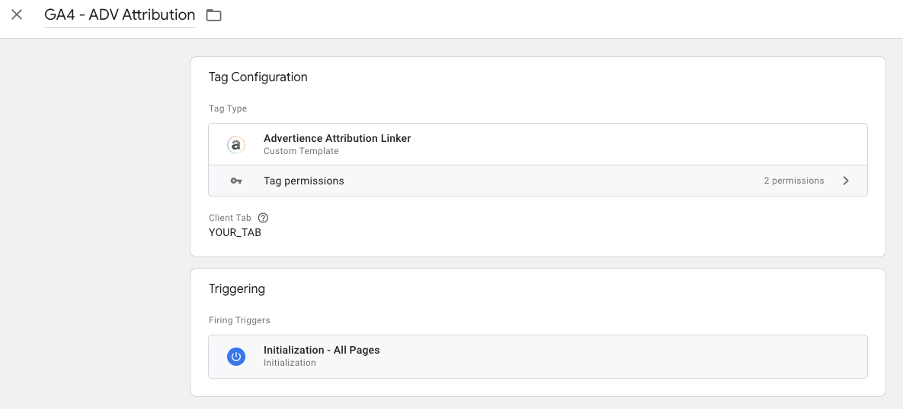
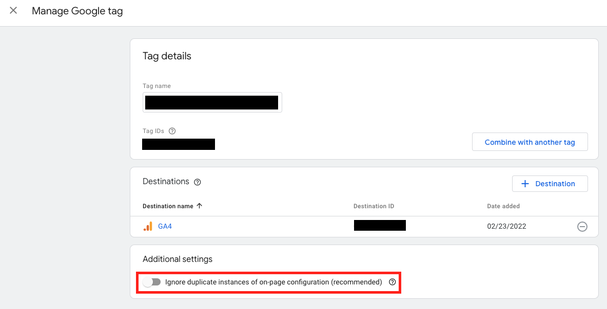

# Advertience Attribution Linker Tag

Advertience Attribution Linker provides simple integration with the Advertience Attribution Solution.

Control attribution to reflect the right channels to accurately measure success.

## Setup

This tag will add three variables to the dataLayer: `source`, `medium`, and `campaign`. It will fire the `adv_pageview` event when finished. These variables will be used to control attribution. Here is how to configure your GTM container to make the most of this tag.

### 1. Add the Advertience Attribution Linker tag

- Navigate to `Tags`
- Create a new tag
- Choose `Advertience Attribution Linker` configuration from the Community Template Gallery
- In `Client Tab`, write your Advertience Attribution client tab name
- To use the attribution on all pages, it is recommended you use the `Initialization - All Pages` trigger. Otherwise create a new trigger that fires on page view of the pages you want them to
- Save the tag

### 2. Make your three dataLayer variables

You will need to create a variable for each of `source`, `medium`, and `campaign`.

- Navigate to `Variables`
- Create new variable, named with `source`, `medium`, or `campaign`
- Choose `Data Layer Variable` configuration
- In `Data Layer Variable Name`, write the appropriate choice of `source`, `medium`, or `campaign`
- Save the variable and repeat until all three variables are created

### 3. Create `adv_pageview` custom event

- Navigate to `Triggers`
- Create new trigger, named `adv_pageview` to avoid confusion
- Choose `Custom Event` configuration
- In `Event name`, write `adv_pageview`
- Save the trigger

### 4. Set your two GA4 Configuration tags

- Navigate to `Tags`
- Click on your `Google Analytics: GA4 Configuration` tag
- Change the name to `GA4 - Config (Init)`
    - Note: All GA4 event tags should use this configuration tag
- Change the trigger to `Initialization - All Pages`
- Create a new tag, named `GA4 - Config (Attribution)`
- For tag type, choose `Google Analytics: GA4 Configuration`
- Open the `Fields to Set` section
- Click the `Add Row` button three times to make space for the three new parameters
- Enter in the `Field Name` rows: `campaign_source`, `campaign_medium`, and `campaign_name`
- For the `Value` rows, click the `+` button and find your appropriate variable from step 2, click on it
- Add the `adv_pageview` trigger from step 3 to the tag
- Save the tag

### 5. Set tag settings in GA4

- Go to your GA4 property
- Navigate to **Admin > Data Streams > [your data stream]**
- Click on `Configure tag settings`
- Click on your google tag
- Under `Additional Settings` toggle OFF `Ignore duplicate instances of on-page configuration (recommended)`

After these steps have been taken, the `GA4 - Config (Attribution)` tag will fire with the proper fields being set with the proper values.

How it works is that when the `adv_pageview` event is fired, the `GA4 - Config (Attribution)` tag will fire and update the appropriate campaign parameters to be used by future GA4 event tags. This means that if you want a GA4 event tag that fires on page view to use the attribution, you must add the `adv_pageview` trigger to it rather than the usual `All Pages` trigger. This could be especially important for those tracking purchases.

It is recommended you test the setup in preview mode to ensure it is working as expected.